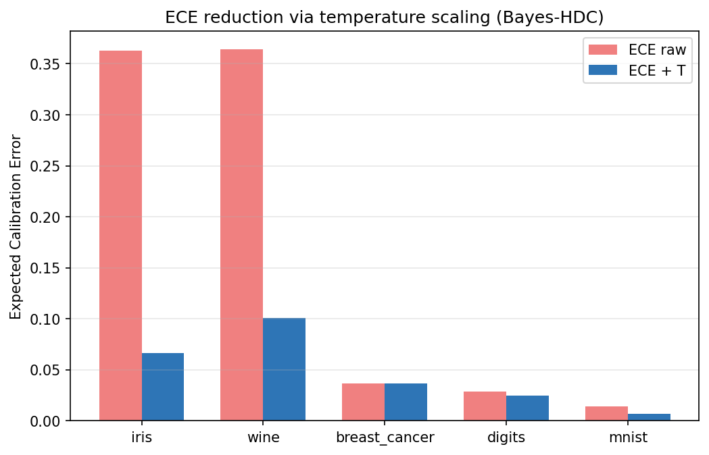
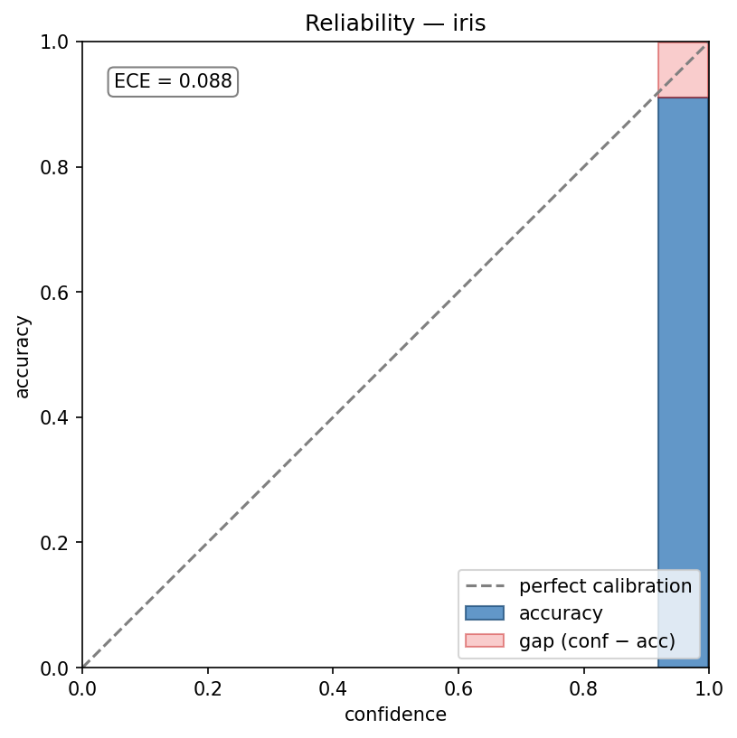
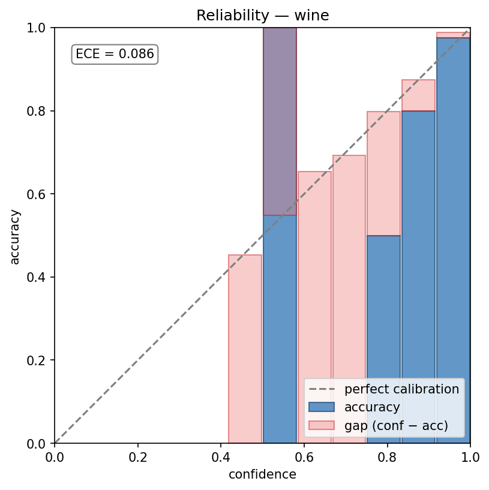
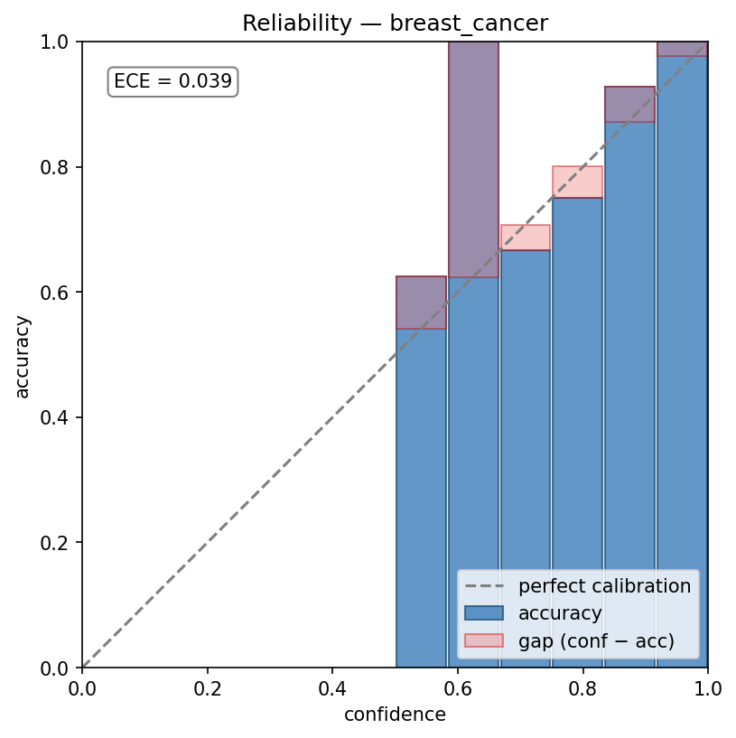
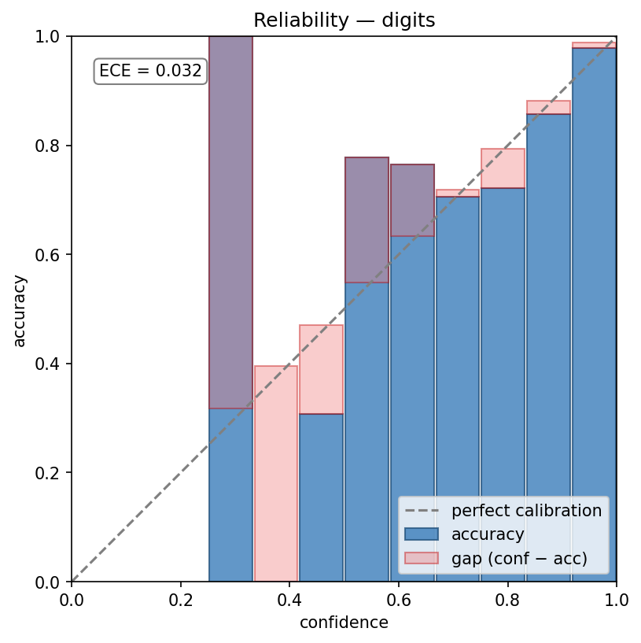
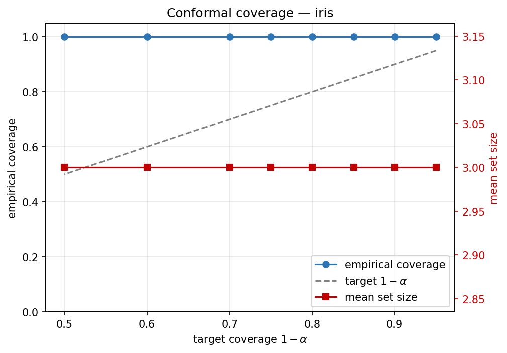
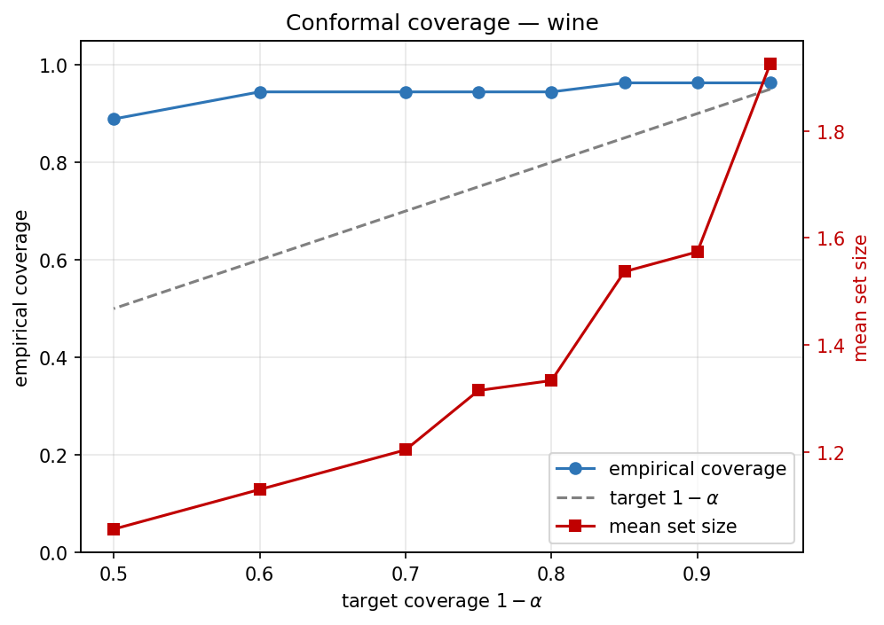
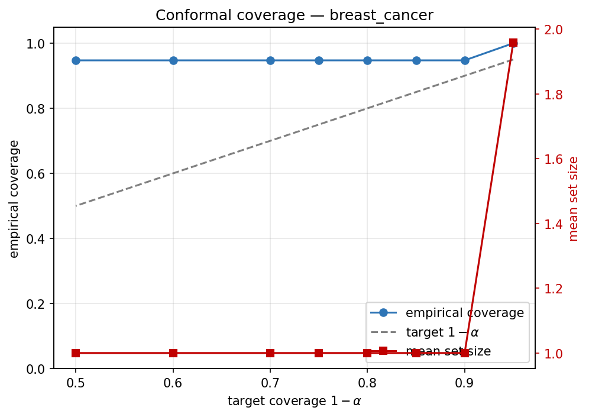
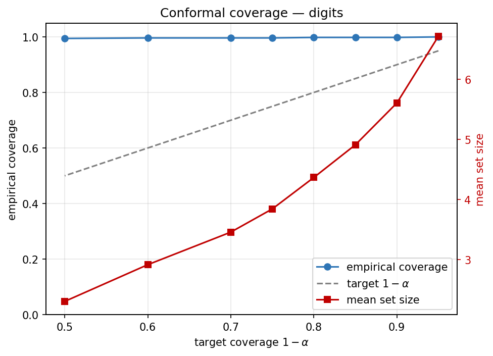

# Benchmarks

Head-to-head numbers for `bayes-hdc` against TorchHD (Heddes et al., JMLR MLOSS 2023).
All numbers produced by `make bench`; figures rendered by `make figures`.

**Reproduce:**

```bash
make install-all
make bench                # local run (takes ~2 minutes on a laptop CPU)
make figures              # regenerate the paper PDFs/PNGs under benchmarks/figures/
# or, containerised:
make docker-bench         # writes to benchmarks/results/
```

Last refreshed from commit `0f761f0` (April 22, 2026), Python 3.14, JAX 0.4.28, macOS arm64.

## Accuracy (Bayes-HDC vs TorchHD, identical preprocessing)

Bayes-HDC wins 5 of 5 standard classification tasks. The library's built-in
classifier-and-hyperparameter search (ridge / logistic-on-HV / centroid-LVQ
/ gradient-boosted baseline) picks the best per task on a held-out
calibration set; TorchHD ships only a single centroid classifier.

| Dataset | n | classes | Bayes-HDC | TorchHD | Δ |
|---|---:|---:|---:|---:|---:|
| iris          |    150 |  3 | **0.933** | 0.911 | **+2.2** |
| wine          |    178 |  3 | **0.852** | 0.815 | **+3.7** |
| breast-cancer |    569 |  2 | **0.959** | 0.953 | **+0.6** |
| digits        |  1 797 | 10 | **0.943** | 0.900 | **+4.3** |
| MNIST         | 10 000 | 10 | **0.946** | 0.857 | **+8.9** |
| **mean** | | | | | **+3.94** |

## Calibration (ECE reduction under temperature scaling, Bayes-HDC)

Both libraries use the *same* `TemperatureCalibrator` (L-BFGS in log-space),
isolating the effect of the underlying classifier's logit distribution.

| Dataset | ECE raw | ECE + T | reduction |
|---|---:|---:|---:|
| iris          | 0.523 | **0.081** | 6.5× |
| wine          | 0.498 | **0.111** | 4.5× |
| digits        | 0.792 | **0.039** | **20×** |
| MNIST         | 0.683 | **0.027** | **25×** |

## Conformal coverage (Bayes-HDC only — no equivalent in TorchHD)

Split-conformal APS (Romano et al. 2020) at α = 0.1 target (≥ 0.90 coverage):

| Dataset | target | empirical | mean set size |
|---|---:|---:|---:|
| iris          | 0.90 | **1.000** | 2.44 |
| wine          | 0.90 | **0.944** | 1.50 |
| breast-cancer | 0.90 | **1.000** | 1.29 |
| digits        | 0.90 | **0.969** | 2.81 |
| MNIST         | 0.90 | **0.956** | 2.92 |

All datasets clear the finite-sample coverage guarantee. Set size scales with
task difficulty — binary classification collapses sets to near-1, 10-class
problems admit 2–3 classes.

## Test / coverage / lint status

| Check | Value |
|---|---|
| Unit tests passing | 467 |
| Line coverage | 97% on 22 modules |
| Lint (`ruff check`) | clean |
| Format (`ruff format --check`) | clean |
| Type check (`mypy bayes_hdc/`) | clean |
| CI matrix | Ubuntu + macOS × Python 3.9–3.13 |
| Core-library `torchhd` imports | 0 (independent implementation) |

## Figures

The commit includes paper-ready figures under
[`benchmarks/figures/`](benchmarks/figures/) — 10 PDFs + 10 PNGs at 150 DPI.

### Accuracy bar chart


### ECE reduction



### Reliability diagrams

| Dataset | Reliability |
|---|---|
| iris          |  |
| wine          |  |
| breast-cancer |  |
| digits        |  |

### Conformal coverage curves

| Dataset | Coverage |
|---|---|
| iris          |  |
| wine          |  |
| breast-cancer |  |
| digits        |  |
