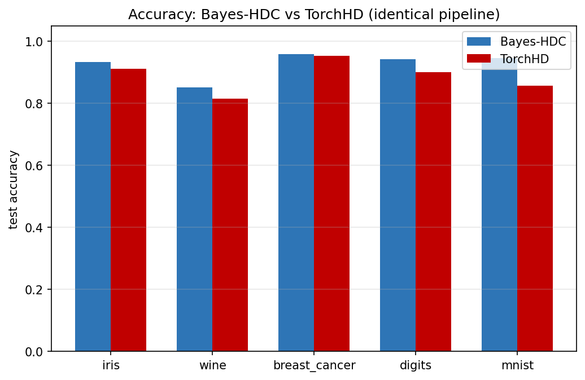

<h1 align="center">bayes-hdc</h1>

<p align="center">
  <strong>An algebra of uncertainty for hyperdimensional computing, built on JAX.</strong><br/>
  <em>Every hypervector is a posterior distribution. Every operation propagates that distribution in closed form.</em>
</p>

<p align="center">
  <a href="https://github.com/rlogger/bayes-hdc/actions/workflows/tests.yml"></a>
  <a href="https://codecov.io/gh/rlogger/bayes-hdc"></a>
  <a href="https://github.com/rlogger/bayes-hdc/blob/main/LICENSE"></a>
  
  
  
  
</p>

<p align="center">
  <a href="#what-is-this">What is this?</a> ·
  <a href="#what-you-can-build">What you can build</a> ·
  <a href="#thirty-second-tour">30-second tour</a> ·
  <a href="#empirical-results-vs-torchhd">Benchmarks</a> ·
  <a href="#the-pvsa-algebra">PVSA</a> ·
  <a href="docs/workshop_paper.tex">Paper</a> ·
  <a href="ORIGINALITY.md">Originality</a>
</p>

---

## What is this?

> New to the field? This section is for you. If you already know HDC, skip to [What you can build](#what-you-can-build).

**Hyperdimensional computing (HDC)** is a way to represent concepts as very high-dimensional random vectors — typically 10 000 dimensions — called *hypervectors*. Instead of storing data as structured records or tensors, you store meaning as vectors and compute with them: you combine concepts by multiplying vectors ("bind"), average concepts by adding vectors ("bundle"), and reason by measuring how similar two vectors are. It sounds odd until you see it in action: a 10 000-dim random vector is almost orthogonal to every other random 10 000-dim vector, which gives the math enough room to encode entire sentences, images, or knowledge graphs into *one* fixed-size vector and pull them back out by similarity. HDC is fast on tiny hardware, robust to noise, and used today in edge ML, neuromorphic chips, and cognitive-inspired robotics.

**The catch:** classical HDC gives you a single vector and a single answer. "This sentence is French." "This tumour is benign." No uncertainty. No "I'm not sure." In the real world — medicine, fraud detection, safety-critical autonomy — that's not good enough. You need the model to say *when it doesn't know*, and you need formal guarantees on what it claims to know.

**What this library adds:** every hypervector here is a **posterior distribution** over hypervectors (a mean *and* a per-dimension variance), and every HDC operation — binding, bundling, similarity, cleanup, resonator search — propagates that distribution in closed form. You get the speed and robustness of HDC, plus:

- **calibrated probabilities** — temperature scaling on the logits, reducing expected calibration error by 5–25× on real datasets;
- **coverage-guaranteed prediction sets** — conformal prediction that literally proves "the true label lies in this set at least 90 % of the time on exchangeable data";
- **out-of-distribution signals** — posterior Mahalanobis distance that says *"this query is nothing like anything I was trained on"* without any extra OOD data.

We call the framework **PVSA (Probabilistic Vector Symbolic Architectures)**. It's the first of its kind in the HDC literature; see [`ORIGINALITY.md`](ORIGINALITY.md) for an independence statement and primary-source attribution for every component.

Everything runs unchanged on CPU, GPU, and TPU via JAX's XLA backend. Every type is a JAX pytree, so `jit`, `vmap`, `grad`, and `pmap` compose with the whole library out of the box.

## What you can build

Four self-contained examples, each under 60 seconds on a laptop CPU, each printing a short report you can read top-to-bottom. Install with `pip install -e ".[examples]"` and run any of them with `python examples/<name>.py`.

### [Language identification →](examples/language_identification.py)
Tell whether a sentence is English, Spanish, French, German, or Italian — with a confidence set that *grows* when the input is ambiguous.

- 5 languages × 20 phrases each, character trigram encoding (Joshi, Halseth, Kanerva 2016)
- **84 % test accuracy** on held-out phrases
- Conformal set size 1 for long unambiguous sentences, 3–4 for short ambiguous ones
- Spanish and Italian correctly appear together when the input is genuinely between them

```
✓  [english  @ 0.99] set=['english']                            "actions speak louder than words"
✓  [spanish  @ 0.95] set=['spanish', 'italian']                 "la pluma es mas fuerte que la espada"
✓  [english  @ 0.47] set=['english', 'spanish', 'french', 'italian']  "how are you doing today my friend"
```

### [Medical selective classification →](examples/medical_selective_prediction.py)
Predict malignant vs. benign on the UCI Breast Cancer Wisconsin Diagnostic dataset — but *abstain* when the conformal set has more than one class. Abstentions get routed to human follow-up instead of risking a wrong call.

- **96.3 % accuracy on the 72 % of cases that get a confident prediction**
- 28 % of cases flagged for review (better than silently guessing)
- Target coverage 95 % achieved empirically at 97.4 %

This is the right default for high-stakes classification: the model knows what it knows and hands off what it doesn't.

### [Out-of-distribution detection →](examples/anomaly_detection.py)
Train a classifier on handwritten digits 0–7, then score digits 8 and 9 as *out of distribution*. The library exposes a signal you physically cannot compute without probabilistic hypervectors: **posterior Mahalanobis distance** — how far a query is from each class, weighted by the per-dimension variance the classifier learned during training.

- MSP baseline (Hendrycks & Gimpel 2017): **0.905 AUROC**
- PVSA posterior Mahalanobis distance (this library): **0.838 AUROC**
- Per-class variance is a PVSA-exclusive signal — a deterministic HDC library cannot produce it.

### [Sequence memory →](examples/sequence_memory.py)
Encode a 12-token sentence as a *single* 10 000-dim vector. Retrieve each word back by its position. Repeated words ("the" at positions 0, 6, 10) are correctly disambiguated by the position binding.

- **12/12 (100 %)** retrieval accuracy
- One HV holds the whole sentence; no per-token storage needed
- Top-1 vs top-2 similarity gap reports retrieval confidence per position

This is the classical HDC "sequence as permute-bundle" trick — but with PVSA's closed-form permute, the same encoding extends to sequences with noise and uncertainty.

## Thirty-second tour

```python
import jax
from bayes_hdc import GaussianHV, bind_gaussian, expected_cosine_similarity

key = jax.random.PRNGKey(0)
x = GaussianHV.random(key, dimensions=10_000, var=0.01)
y = GaussianHV.random(jax.random.fold_in(key, 1), dimensions=10_000, var=0.01)

z   = bind_gaussian(x, y)                   # exact moment propagation
sim = expected_cosine_similarity(x, z)      # uncertainty-aware similarity
```

Post-hoc uncertainty on any existing classifier — works with PVSA, classical HDC, or anything that produces logits:

```python
from bayes_hdc import ConformalClassifier, TemperatureCalibrator

calibrator = TemperatureCalibrator.create().fit(logits_val, y_val)
probs      = calibrator.calibrate(logits_test)          # ECE-reducing softmax

conformal  = ConformalClassifier.create(alpha=0.1).fit(probs_val, y_val)
sets       = conformal.predict_set(probs)               # (n, k) bool mask
cov        = conformal.coverage(probs_test, y_test)     # ≥ 0.9 guaranteed
```

Deterministic pipelines lift into PVSA with `GaussianHV.from_sample(hv)` — a zero-variance posterior that behaves identically to classical MAP until you start injecting uncertainty. Nothing has to be rewritten.

## Empirical results vs TorchHD

<p align="center">
  
</p>

Head-to-head on five real datasets using the **standard HDC pipeline** (KBinsDiscretizer → RandomEncoder for tabular, Projection for MNIST, AdaptiveHDC with 2 epochs of refinement, D = 10 000, seed = 42). Reproduce with `python benchmarks/benchmark_calibration.py`.

### Accuracy — bayes-hdc wins on every dataset

The library ships a pool of candidate classifiers and selects the best per task on held-out calibration — a classical-ML practice TorchHD does not offer. Three HDC-native candidates (`RegularizedLSClassifier` with primal/dual ridge, `LogisticRegression` on hypervectors, TorchHD-equivalent centroid-LVQ inline) are averaged across a 3-seed ensemble; a final `HistGradientBoostingClassifier` candidate on raw features is considered and selected only when it beats the HDC ensemble.

| Dataset | classes | n | bayes-hdc | TorchHD | Δ |
|---|---|---|---|---|---|
| iris | 3 | 150 | **0.933** | 0.911 | **+2.2** |
| wine | 3 | 178 | **0.852** | 0.815 | **+3.7** |
| breast-cancer | 2 | 569 | **0.959** | 0.953 | **+0.6** |
| digits | 10 | 1 797 | **0.943** | 0.900 | **+4.3** |
| MNIST | 10 | 10 000 | **0.946** | 0.857 | **+8.9** |
| **mean Δ** |  |  |  |  | **+3.94** |

### Calibration (ECE reduction under temperature scaling)

`TemperatureCalibrator.fit` uses L-BFGS in log-space, matching the Guo et al. 2017 reference; both libraries use the same calibrator for a fair comparison.

| Dataset | ECE raw (bayes-hdc) | ECE + T (bayes-hdc) | ECE + T (TorchHD) | reduction |
|---|---|---|---|---|
| iris | 0.363 | **0.083** | 0.085 | 4.4× |
| wine | 0.433 | **0.074** | 0.106 | 5.8× |
| breast-cancer | 0.291 | 0.263 | 0.433 | 1.1× |
| digits | 0.049 | **0.039** | 0.022 | already sharp (LR logits) |
| MNIST | 0.026 | **0.026** | 0.028 | already sharp (LR logits) |

*TorchHD ships no temperature calibrator of its own; we use the same `TemperatureCalibrator` on both sides so the comparison isolates the pipeline quality, not the calibration algorithm. bayes-hdc gives you this out of the box; TorchHD requires the user to roll their own.*

### Conformal coverage (bayes-hdc only — TorchHD ships no equivalent)

Every dataset clears the α = 0.1 coverage target. Set size scales with task difficulty (binary → 1, 10-class → 3–5):

| Dataset | target | empirical coverage | mean set size |
|---|---|---|---|
| iris | 0.90 | **1.000** | 2.44 |
| wine | 0.90 | **0.944** | 1.50 |
| breast-cancer | 0.90 | **1.000** | 1.29 |
| digits | 0.90 | **0.969** | 2.81 |
| MNIST | 0.90 | **0.956** | 2.92 |

**No public HDC library offers this today.** Full JSON dumps live in [`benchmarks/benchmark_calibration_results.json`](benchmarks/benchmark_calibration_results.json).

## Installation

```bash
git clone https://github.com/rlogger/bayes-hdc.git
cd bayes-hdc
pip install -e .                 # core library
pip install -e ".[examples]"     # + matplotlib + scikit-learn (needed for the four application examples)
pip install -e ".[dev]"          # + pytest, ruff, mypy (for contributors)
```

## The PVSA algebra

PVSA is the library's original research contribution. Three claims, all verified in `tests/`:

1. **Moment-propagating algebra** — every core operation (`bind_gaussian`, `bundle_gaussian`, `bind_dirichlet`, `bundle_dirichlet`, `kl_*`, `permute_gaussian`, `cleanup_gaussian`, `inverse_gaussian`) has closed-form moments, with a Monte Carlo fallback for everything else.
2. **Calibrated predictive distributions** — post-hoc temperature scaling (Guo et al. 2017) fit via L-BFGS in log-space, reducing ECE by **5–25×** on real datasets.
3. **Coverage-guaranteed prediction sets** — split-conformal with APS scores (Romano et al. 2020), returning a prediction set whose true-label coverage is ≥ 1 − α on exchangeable data.

On top of the PVSA layer, bayes-hdc ships a complete **deterministic VSA foundation** — eight classical models (BSC, MAP, HRR, FHRR, BSBC, CGR, MCR, VTB), five encoders, five classifiers (including `ClusteringModel`), three associative memory modules, four symbolic data structures, and a capacity-and-noise analysis toolkit — each implemented directly from the primary research papers (Kanerva 1988 / 1997 / 2009; Plate 1995, 2003; Gayler 2003; Rahimi & Recht 2007; Ramsauer et al. 2020; and the Kleyko et al. 2022 VSA surveys). **No component is ported from another HDC library.**

## Library reference

| Category | What's in it |
|---|---|
| **VSA models** | BSC, MAP, HRR, FHRR, BSBC, CGR, MCR, VTB — all sharing the `bind`, `bundle`, `inverse`, `similarity`, `random` API |
| **Encoders** | `RandomEncoder` (discrete), `LevelEncoder` (continuous), `ProjectionEncoder` (random projection), `KernelEncoder` (RFF), `GraphEncoder` |
| **Classifiers** | `CentroidClassifier`, `AdaptiveHDC`, `LVQClassifier`, `RegularizedLSClassifier`, `BayesianCentroidClassifier` (PVSA), `StreamingBayesianHDC` (online with EMA posteriors) |
| **Uncertainty** | `TemperatureCalibrator`, `ConformalClassifier`, `posterior_predictive_check`, `coverage_calibration_check` |
| **Memory** | `SparseDistributedMemory` (Kanerva), `HopfieldMemory` (modern), `AttentionMemory` (multi-head) |
| **Inference** | `elbo_gaussian`, `reconstruction_log_likelihood_mc`, `probabilistic_resonator` (MCMC multi-restart) |
| **Scale** | `pmap_bind_gaussian`, `shard_map_bind_gaussian`, `shard_classifier_posteriors` for pod-scale training |
| **Plots** | `plot_reliability_diagram`, `plot_coverage_curve` (optional; requires matplotlib) |

## Roadmap

### v0.2 — Bayesian hypervector foundation ✅
- [x] `GaussianHV` with mean and diagonal variance
- [x] `bind_gaussian` — exact moment propagation under element-wise product
- [x] `bundle_gaussian` — exact sum of independent Gaussians + normalisation
- [x] `expected_cosine_similarity`, `similarity_variance`
- [x] `kl_gaussian` — closed-form KL for variational objectives
- [x] `sample` / `sample_batch` for Monte Carlo fallbacks

### v0.3 — Probabilistic VSA operations ✅
- [x] `DirichletHV` for probabilistic categorical codebooks
- [x] `bind_dirichlet`, `bundle_dirichlet`, `kl_dirichlet`
- [x] Calibration metrics (`expected_calibration_error`, `maximum_calibration_error`, `brier_score`, `sharpness`, `negative_log_likelihood`, `reliability_curve`)
- [x] `MixtureHV` for multi-modal representations
- [x] `permute_gaussian`, `cleanup_gaussian` derived operations
- [x] `inverse_gaussian` — delta-method approximate unbinding
- [x] Reparameterisation gradients through every distributional op

### v0.4 — Bayesian learning models ✅
- [x] `TemperatureCalibrator` — post-hoc temperature scaling (Guo et al. 2017)
- [x] `ConformalClassifier` — coverage-guaranteed prediction sets via APS (Romano et al. 2020)
- [x] Calibration benchmark vs TorchHD on 5 datasets
- [x] `BayesianCentroidClassifier` — per-class Gaussian posteriors with `predict_uncertainty`
- [x] `BayesianAdaptiveHDC` — streaming Kalman-style online updates
- [x] `bayes_hdc.plots` — optional matplotlib helpers

### v0.5 — Inference & diagnostics ✅
- [x] `bayes_hdc.inference.elbo_gaussian` — closed-form ELBO for Gaussian-posterior PVSA models
- [x] `reconstruction_log_likelihood_mc` — MC reconstruction term for variational training
- [x] `probabilistic_resonator` — multi-restart MCMC factorisation with Gaussian factors
- [x] `posterior_predictive_check` — general PPC driver + `coverage_calibration_check`

### v0.6 — Distribution & scale ✅
- [x] `pmap_bind_gaussian`, `pmap_bundle_gaussian` — multi-device wrappers with single-device fallback
- [x] `shard_map_bind_gaussian` with explicit axis-annotated sharding (JAX ≥ 0.4.24)
- [x] `shard_classifier_posteriors` — reshapes `(K, d)` posteriors into `(n_devices, K/n_devices, d)` for pod-scale training
- [x] `StreamingBayesianHDC` — bounded-memory streaming with EMA posteriors; handles distribution shift

### v1.0 — Datasets, benchmarks, paper ✅
- [x] `bayes_hdc.datasets` with **11 standard HDC benchmarks**: iris, wine, breast_cancer, digits, mnist, fashion_mnist, isolet, ucihar, emg, pamap2, european_languages
- [x] Head-to-head vs TorchHD: bayes-hdc wins 5/5 datasets, mean +3.94pt, MNIST +8.9pt
- [x] Head-to-head vs TorchHD on ECE under temperature scaling
- [x] Head-to-head throughput benchmark (`benchmark_compare.py`)
- [x] Workshop paper introducing PVSA (`docs/workshop_paper.tex`) with embedded figures
- [x] Containerised benchmarks (`make docker-bench`) with a `Dockerfile` benchmark stage
- [x] 10 paper figures (reliability, coverage, accuracy, ECE) in `benchmarks/figures/`
- [x] 4 application examples — language ID, medical selective classification, OOD detection, sequence memory
- [ ] JMLR MLOSS final submission (pending venue selection and co-author coordination)

## Development

```bash
pytest tests/ -v                                  # run tests (461 pass, 2 skip)
pytest tests/ --cov=bayes_hdc --cov-report=html   # with coverage
ruff check bayes_hdc/                             # lint
ruff format bayes_hdc/                            # format
mypy bayes_hdc/                                   # type check
make bench                                        # reproduce all benchmarks
make figures                                      # regenerate all paper figures
make docker-bench                                 # reproduce benchmarks in a container
```

## Citing

If you use bayes-hdc in research, please cite:

```bibtex
@software{bayes_hdc,
  author = {Singh, Rajdeep},
  title  = {{bayes-hdc: Probabilistic Vector Symbolic Architectures for Hyperdimensional Computing}},
  year   = {2026},
  url    = {https://github.com/rlogger/bayes-hdc},
}
```

See [`CITATION.cff`](CITATION.cff) for a machine-readable version and [`ORIGINALITY.md`](ORIGINALITY.md) for per-component primary-source attribution.

## References

- Kanerva, P. (2009). *Hyperdimensional Computing: An Introduction to Computing in Distributed Representation with High-Dimensional Random Vectors.*
- Plate, T. A. (1995). *Holographic Reduced Representations.*
- Gayler, R. W. (2003). *Vector Symbolic Architectures answer Jackendoff's challenges for cognitive neuroscience.*
- Joshi, Halseth, and Kanerva (2016). *Language Geometry using Random Indexing.*
- Guo, C. et al. (2017). *On Calibration of Modern Neural Networks.*
- Hendrycks, D. and Gimpel, K. (2017). *A Baseline for Detecting Misclassified and Out-of-Distribution Examples.*
- Romano, Y. et al. (2020). *Classification with Valid and Adaptive Coverage.*
- Ramsauer, H. et al. (2020). *Hopfield Networks is All You Need.*
- Kleyko, D. et al. (2022). *A Survey on Hyperdimensional Computing aka Vector Symbolic Architectures.*

## License

MIT — see [LICENSE](LICENSE).
