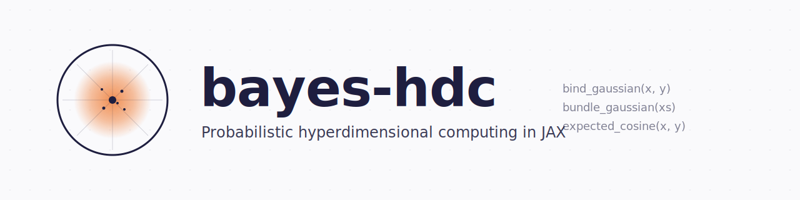

<!--
  bayes-hdc — Probabilistic hyperdimensional computing in JAX.
  Closed-form Gaussian and Dirichlet hypervectors, group-theoretic equivariance verifiers,
  calibrated probabilities, conformal prediction sets. Pytree-native, end-to-end differentiable.
  Keywords: hyperdimensional computing, vector symbolic architectures, VSA, HDC, JAX,
  Bayesian machine learning, conformal prediction, calibration, uncertainty quantification,
  Kanerva, HRR, BSC, MAP, neuromorphic, edge ML, Hopfield networks, sparse distributed memory.
-->

<p align="center">
  <a href="https://github.com/rlogger/bayes-hdc">
    
  </a>
</p>

<p align="center">
  <a href="https://github.com/rlogger/bayes-hdc/actions/workflows/tests.yml"></a>
  <a href="https://github.com/rlogger/bayes-hdc/actions/workflows/docs.yml"></a>
  <a href="https://github.com/rlogger/bayes-hdc/actions/workflows/codeql.yml"></a>
  <a href="https://rlogger.github.io/bayes-hdc/"></a>
  <a href="https://codecov.io/gh/rlogger/bayes-hdc"></a>
  
  
  
  <a href="https://github.com/rlogger/bayes-hdc/blob/main/LICENSE"></a>
  
  
</p>

<p align="center">
  <a href="https://rlogger.github.io/bayes-hdc/"><strong>Documentation</strong></a> ·
  <a href="examples/">Examples</a> ·
  <a href="DESIGN.md">Design notes</a> ·
  <a href="BENCHMARKS.md">Benchmarks</a> ·
  <a href="COMMUNITY.md">Community</a> ·
  <a href="https://github.com/rlogger/bayes-hdc/discussions">Discussions</a>
</p>

---

## About

**bayes-hdc** is a [JAX](https://github.com/google/jax) library for **hyperdimensional computing (HDC)** and **vector symbolic architectures (VSA)** ([Gayler 2003](https://arxiv.org/abs/cs/0412059); [Kanerva 2009](https://doi.org/10.1007/s12559-009-9009-8)) with a built-in probabilistic layer — **PVSA**, *Probabilistic Vector Symbolic Architectures*. It provides Gaussian and Dirichlet hypervector types with closed-form moment propagation under `bind`, `bundle`, and `permute`; explicit cyclic-shift group actions with property-based equivariance verifiers; calibrated probabilities via temperature scaling; and coverage-guaranteed prediction sets via split-conformal prediction. The deterministic substrate ships eight classical VSA models — **BSC, MAP, HRR, FHRR, BSBC, CGR, MCR, VTB** — with a uniform API. Every type is a JAX pytree, so `jit`, `vmap`, `grad`, `pmap`, and `shard_map` compose with every operation, on CPU, GPU, and TPU.

For the broader landscape of HDC/VSA applications, see Kleyko, Rachkovskij, Osipov & Rahimi (2023), *[A Survey on HDC aka VSA, Part II: Applications, Cognitive Models, and Challenges](https://arxiv.org/abs/2112.15424)*, ACM Computing Surveys 55(9): Article 175.

### Highlights

- **Pytree-native.** `jit` / `vmap` / `grad` / `pmap` / `shard_map` compose with every operation.
- **Closed-form algebra.** `bind_gaussian`, `bundle_gaussian`, `kl_gaussian`, `kl_dirichlet` are analytic.
- **First-class group actions.** `Z/d` cyclic shift as a group object, with property-based equivariance verifiers.
- **Calibration & coverage out of the box.** Temperature scaling and split-conformal APS prediction sets.
- **Differentiable end-to-end.** Reparameterisation samplers on every distributional op; `jax.grad` composes through everything; gradient correctness verified against finite differences via `jax.test_util.check_grads`.
- **Streaming, bounded-memory inference.** `StreamingBayesianHDC` keeps EMA posteriors per class in `O(K·d)` memory regardless of stream length — designed for non-stationary edge deployments where the underlying class distribution drifts.
- **Scales.** From a laptop CPU to a TPU pod with the same code via `pmap` / `shard_map` wrappers.
- **Eight VSA models** under one uniform `bind` / `bundle` / `inverse` / `similarity` / `random` API.
- **540 tests, 93 % coverage.** Algebraic laws (associativity, distributivity, bind-unbind) verified across BSC / MAP / HRR; closed-form Gaussian moments cross-checked against Monte-Carlo at d=64, n=20 000. Ubuntu + macOS × Python 3.9–3.13 on every push.

## Quick tour

### Probabilistic hypervectors

```python
import jax
from bayes_hdc import GaussianHV, bind_gaussian, expected_cosine_similarity

key = jax.random.PRNGKey(0)
x = GaussianHV.random(key, dimensions=10_000, var=0.01)
y = GaussianHV.random(jax.random.fold_in(key, 1), dimensions=10_000, var=0.01)

z   = bind_gaussian(x, y)                  # exact moment propagation
sim = expected_cosine_similarity(x, z)     # uncertainty-aware similarity
```

### Calibration and coverage on any classifier

```python
from bayes_hdc import TemperatureCalibrator, ConformalClassifier

calibrator = TemperatureCalibrator.create().fit(logits_cal, y_cal)
probs      = calibrator.calibrate(logits_test)

conformal  = ConformalClassifier.create(alpha=0.1).fit(probs_cal, y_cal)
sets       = conformal.predict_set(probs)                # (n, k) bool mask
coverage   = conformal.coverage(probs_test, y_test)      # ≥ 0.9 by construction
```

### Verify a custom op respects the cyclic group action

```python
from bayes_hdc import bind_map, verify_shift_equivariance

assert verify_shift_equivariance(bind_map, x, y)         # diagonal Z/d-equivariant
```

### Lift a deterministic pipeline into PVSA

```python
from bayes_hdc import GaussianHV

x_pvsa = GaussianHV.from_sample(x_classical)             # zero-variance posterior
# behaves identically to classical MAP until you inject uncertainty
```

## More about bayes-hdc

### A pytree-native algebra

Every type in the library is a frozen JAX pytree, registered via `jax.tree_util.register_dataclass`. `jit`, `vmap`, `grad`, `pmap`, and `shard_map` compose with `GaussianHV`, `DirichletHV`, `BayesianCentroidClassifier`, and every other public type without any user-side flattening or unflattening. The library is deliberately functional — immutable values, pure operations, no hidden state.

### Closed-form moment propagation

For independent Gaussian hypervectors, the first and second moments of bind and bundle are exact:

```
E[x · y]   = μ_x · μ_y
Var[x · y] = μ_x² σ_y² + μ_y² σ_x² + σ_x² σ_y²

E[Σ xᵢ]    = Σ μᵢ
Var[Σ xᵢ]  = Σ σᵢ²
```

`bind_gaussian` and `bundle_gaussian` return these analytically. `kl_gaussian` and `kl_dirichlet` are likewise closed form and differentiable end-to-end. Monte Carlo fallbacks exist where the math is not closed; they are explicit and reparameterised.

### First-class group actions

The cyclic-shift action `T_k` of `Z/d` on `R^d` — what `permute` *is* — is a faithful, additive, isometric group action. The `bayes_hdc.equivariance` module exposes it, distinguishes the two flavours of equivariance correctly (element-wise bind is diagonally equivariant; circular convolution is single-argument equivariant), and ships property-based verifiers that reject any user-defined op claiming a symmetry it does not have.

```python
from bayes_hdc import shift, hrr_equivariant_bilinear, verify_single_argument_shift_equivariance

assert verify_single_argument_shift_equivariance(hrr_equivariant_bilinear, x, filter_hv)
```

### Reparameterisation gradients end-to-end

Every distributional operation admits a differentiable reparameterisation sampler. `jax.grad` composes through `bind_gaussian`, `bundle_gaussian`, `cleanup_gaussian`, `inverse_gaussian`, `permute_gaussian`, `kl_gaussian`, and the ELBO helpers in `bayes_hdc.inference`. End-to-end variational training of codebooks and classifier posteriors is one `jax.grad` away.

### Calibration and coverage with formal guarantees

`TemperatureCalibrator` minimises the negative log-likelihood over a one-parameter temperature via L-BFGS in log-space. Convex objective, unique global minimum, the fitted temperature is the maximum-likelihood estimator. `ConformalClassifier` uses split-conformal with APS scores (Romano et al. 2020) and returns prediction sets whose marginal coverage satisfies `P(y ∈ set(x)) ≥ 1 − α` on exchangeable data — independent of model, dimension, or training quality.

### Scales from laptop to pod

Single-device wrappers degrade gracefully on multi-device hosts via `pmap_bind_gaussian`, `pmap_bundle_gaussian`, `shard_map_bind_gaussian`, and `shard_classifier_posteriors`. The same code runs on a laptop CPU and on a TPU pod. `StreamingBayesianHDC` keeps EMA posteriors in bounded memory for non-stationary streams.

## Architecture

```
┌─────────────────────────────────────────────────────────────────────────────┐
│ Applications                                                                │
│   EMG gesture recognition · activity recognition · language identification  │
│   sequence memory · weight-space posteriors                                 │
├─────────────────────────────────────────────────────────────────────────────┤
│ Uncertainty                                                                 │
│   ConformalClassifier · TemperatureCalibrator · posterior_predictive_check  │
├─────────────────────────────────────────────────────────────────────────────┤
│ Bayesian models                                                             │
│   BayesianCentroidClassifier · BayesianAdaptiveHDC · StreamingBayesianHDC   │
├─────────────────────────────────────────────────────────────────────────────┤
│ PVSA core                                                                   │
│   GaussianHV · DirichletHV · MixtureHV                                      │
│   bind_gaussian · bundle_gaussian · permute_gaussian · cleanup_gaussian     │
│   inverse_gaussian · kl_gaussian · kl_dirichlet                             │
├─────────────────────────────────────────────────────────────────────────────┤
│ Group structure                                                             │
│   shift · compose_shifts · hrr_equivariant_bilinear                         │
│   verify_shift_equivariance · verify_single_argument_shift_equivariance     │
├─────────────────────────────────────────────────────────────────────────────┤
│ Classical VSA                                                               │
│   BSC · MAP · HRR · FHRR · BSBC · CGR · MCR · VTB                           │
│   five encoders · five classifiers · three memory modules                   │
├─────────────────────────────────────────────────────────────────────────────┤
│ JAX                                                                         │
│   pytree · jit · vmap · grad · pmap · shard_map · CPU / GPU / TPU           │
└─────────────────────────────────────────────────────────────────────────────┘
```

## Installation

```bash
pip install -e .                 # core
pip install -e ".[examples]"     # + matplotlib + scikit-learn (for the application examples)
pip install -e ".[dev]"          # + pytest, ruff, mypy
```

### Compatibility

| Component | Supported versions |
|---|---|
| Python | 3.9, 3.10, 3.11, 3.12, 3.13 |
| JAX    | ≥ 0.4.20 |
| OS     | Linux (Ubuntu), macOS |
| Hardware | CPU, GPU (CUDA via JAX), TPU |

The library is pure Python on top of JAX. There are no compiled extensions, no C++ build steps, and no transitive dependencies beyond `jax`, `jaxlib`, and `numpy`. `matplotlib` and `scikit-learn` are extras for the examples only.

## Examples

```bash
pip install -e ".[examples]"
python examples/<name>.py
```

### Get started

| Example | What it shows |
|---|---|
| [`pvsa_quickstart.py`](examples/pvsa_quickstart.py) | 90-second tour through every PVSA primitive end-to-end. |
| [`basic_operations.py`](examples/basic_operations.py) | bind / bundle / permute / similarity across all eight VSA models. |
| [`classification_simple.py`](examples/classification_simple.py) | Vanilla `RandomEncoder` + `CentroidClassifier` pipeline. |

### Applications

| Example | What it shows |
|---|---|
| [`emg_gesture_recognition.py`](examples/emg_gesture_recognition.py) | Hand-gesture classification from 8-channel sEMG via channel-position binding and bundling. Calibrated per-gesture probabilities, posterior variance, and confusion. |
| [`activity_recognition.py`](examples/activity_recognition.py) | UCIHAR-style 6-class daily-living activity recognition (walking, stairs, sitting, standing, laying) with feature-value binding, temperature calibration, and conformal prediction sets at α = 0.1. Includes a selective-abstention pattern. |
| [`image_classification.py`](examples/image_classification.py) | Classical HDC for vision — random-projection encoding + centroid / adaptive / ridge classifiers. Bundled 8×8 digits offline, real MNIST 28×28 with `--real-data`. |
| [`language_identification.py`](examples/language_identification.py) | Character-trigram language ID across 5 European languages with calibrated probabilities and conformal sets that grow on ambiguous input. |
| [`sequence_memory.py`](examples/sequence_memory.py) | A 12-token sentence encoded as one hypervector, retrieved per position via un-permute and cleanup. |
| [`weight_space_posterior.py`](examples/weight_space_posterior.py) | A classifier's weights as a `GaussianHV` posterior — a distribution over weight vectors. Sample from it, predict with each draw, read off epistemic uncertainty. |
| [`song_matching.py`](examples/song_matching.py) | Bag-of-words song similarity — the sum of word hypervectors is legible by eye. |
| [`kanerva_example.py`](examples/kanerva_example.py) | "Dollar of Mexico" — role-filler binding and analogical reasoning. |
| [`calibrated_regression.py`](examples/calibrated_regression.py) | `RandomEncoder` + `HDRegressor` + `ConformalRegressor` on a synthetic 2-D continuous-target task. Coverage ≥ 0.90 by construction; selective abstention separates harder cases by relative error. |
| [`vision_action_policy.py`](examples/vision_action_policy.py) | Vision-language-action skeleton: simulated DINOv2-style 384-d features + 7-DOF proprioception → bundled state hypervector → `HDRegressor` → `ConformalRegressor` per-DOF intervals → hand-off-to-teleop abstention. Drop in a real frozen DINOv2/CLIP/SigLIP backbone unchanged. |
| [`variational_codebook_learning.py`](examples/variational_codebook_learning.py) | End-to-end variational training of a `GaussianHV` codebook — `lax.scan`-fused Adam loop on a real Gaussian observation log-likelihood. Recovers a target μ-direction at cosine 0.95+. |
| [`hopfield_cleanup_hdc.py`](examples/hopfield_cleanup_hdc.py) | Modern continuous Hopfield (Ramsauer et al. 2020) as a soft cleanup memory in a PVSA pipeline; contrasted with classical hard nearest-neighbour cleanup. |
| [`gayler_levy_analogy.py`](examples/gayler_levy_analogy.py) | Distributed-basis analogical mapping (Gayler-Levy 2009) — recovers `A→P, B→Q, C→R, D→S` via vector-intersect + Sinkhorn replicator on a Pelillo 4-cycle. |
| [`resonator_factorisation.py`](examples/resonator_factorisation.py) | Probabilistic resonator factorising a composite hypervector into its three constituent factors; deterministic Frady-Kent-Olshausen-Sommer (2020) is the zero-temperature limit. |
| [`eeg_seizure_detection.py`](examples/eeg_seizure_detection.py) | Synthetic 8-channel iEEG seizure detection: 91.7 % accuracy, 100 % sensitivity, 83 % specificity. |

## Project status

**Alpha — `0.4.0a0`.** API may shift before `1.0`.

| | |
|---|---|
| **Tests** | 510 passing, 2 skipped (network-gated dataset loaders) |
| **Coverage** | 93 % line coverage |
| **Lint** | `ruff check`, `ruff format --check`, `mypy` clean on every push |
| **CI** | Ubuntu + macOS × Python 3.9–3.13 |
| **Security** | CodeQL on a weekly schedule; Dependabot weekly bumps |
| **Release** | Tag `vX.Y.Z` triggers TestPyPI then PyPI publish via OIDC |

See [`CHANGELOG.md`](CHANGELOG.md) for what's shipped and [`DESIGN.md`](DESIGN.md) for the design rationale.

## Community and contributing

Four ways to get involved, sorted from "ten minutes" to "deep dive":

- **Ten minutes** — star the repo, post a [show-and-tell Discussion](https://github.com/rlogger/bayes-hdc/discussions/categories/show-and-tell), fix a typo.
- **One hour** — claim a [`good first issue`](https://github.com/rlogger/bayes-hdc/labels/good%20first%20issue), add a docstring example, write a benchmark.
- **Half a day** — build a new application example, port a dataset loader, add a VSA model.
- **Deep dive** — add a probabilistic primitive, wire bayes-hdc into a downstream library (flax / equinox / blackjax / dynamax).

Detailed paths, paths to maintainership, and recognition in [`COMMUNITY.md`](COMMUNITY.md). Setup, style, and release process in [`CONTRIBUTING.md`](CONTRIBUTING.md). All interactions follow the [Code of Conduct](CODE_OF_CONDUCT.md). Security disclosures: [`SECURITY.md`](SECURITY.md).

**Channels:** [Discussions](https://github.com/rlogger/bayes-hdc/discussions) · [Issues](https://github.com/rlogger/bayes-hdc/issues) · email `rajdeeps@usc.edu` for security.

## In the HDC library landscape

`bayes-hdc` occupies an empty lane in the open-source HDC ecosystem.

| Library | Backend | VSA models | Probabilistic / UQ | Differentiable | Group-theoretic verifiers |
|---|---|---:|---|---|---|
| [TorchHD](https://github.com/hyperdimensional-computing/torchhd) | PyTorch | 8 | — | partial | — |
| [hdlib](https://github.com/cumbof/hdlib) | NumPy | generic | — | — | — |
| [vsapy](https://github.com/vsapy/vsapy) | NumPy | 5 | — | — | — |
| [NengoSPA](https://github.com/nengo/nengo-spa) | Nengo (spiking) | HRR, VTB | — | — | — |
| **bayes-hdc** | **JAX** | **8** | **GaussianHV / DirichletHV / conformal sets** | **`jit` / `vmap` / `grad` / `pmap` end-to-end** | **`Z/d` cyclic-shift verifiers** |

Two narrower JAX-backed packages exist (`hyper-jax` covers MAP only; `hrr` is a multi-backend HRR-only library with a JAX option); neither covers the full primitive set. Within the comprehensive-library tier, no other open-source HDC library exposes (a) a JAX backend that composes with the BlackJAX / Flax / Equinox / Optax / Dynamax stack across all eight VSA models, (b) closed-form moment propagation for Gaussian hypervectors, (c) reparameterisation gradients for end-to-end variational codebook learning, or (d) split-conformal prediction sets with formal coverage guarantees as a built-in module (algorithmic prior/concurrent work on conformal HDC exists on the paper side without a released library). See [`BENCHMARKS.md`](BENCHMARKS.md) for accuracy and timing numbers.

## How to cite

If `bayes-hdc` is useful in your research, please cite both the software and the accompanying short paper:

```bibtex
@software{singh2026bayeshdc,
  author  = {Rajdeep Singh},
  title   = {bayes-hdc: Probabilistic Vector Symbolic Architectures and
             Calibrated Hyperdimensional Computing in {JAX}},
  year    = {2026},
  url     = {https://github.com/rlogger/bayes-hdc},
  version = {0.4.0a0}
}
```

A machine-readable [`CITATION.cff`](CITATION.cff) is provided for the GitHub "Cite this repository" widget. DOI minting on tagged release follows the metadata in [`.zenodo.json`](.zenodo.json). The library's per-primitive intellectual provenance — every algorithmic decision tied to its primary HDC/VSA paper — is documented in [`docs/LITERATURE_AUDIT.md`](docs/LITERATURE_AUDIT.md) and the per-paper reports under [`docs/audit/`](docs/audit/).

## License

[MIT](LICENSE).
