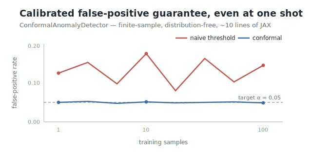

<p align="center">
  <a href="https://github.com/rlogger/bayes-hdc">
    
  </a>
</p>

<p align="center">
  <a href="https://github.com/rlogger/bayes-hdc/actions/workflows/tests.yml"></a>
  <a href="https://github.com/rlogger/bayes-hdc/actions/workflows/docs.yml"></a>
  <a href="https://github.com/rlogger/bayes-hdc/actions/workflows/codeql.yml"></a>
  
  <a href="LICENSE"></a>
</p>

<p align="center">
  <a href="https://rlogger.github.io/bayes-hdc/"><strong>Documentation</strong></a> ·
  <a href="https://colab.research.google.com/github/rlogger/bayes-hdc/blob/main/tutorials/01_quickstart.ipynb">Quickstart in Colab</a> ·
  <a href="examples/">Examples</a> ·
  <a href="BENCHMARKS.md">Benchmarks</a> ·
  <a href="https://github.com/rlogger/bayes-hdc/discussions">Discussions</a>
</p>

**bayes-hdc** is a JAX library for hyperdimensional computing (HDC/VSA) whose predictions come with statistical guarantees. Existing HDC libraries — [TorchHD](https://github.com/hyperdimensional-computing/torchhd), [hdlib](https://github.com/cumbof/hdlib), [HoloVec](https://github.com/Twistient/HoloVec) — ship the deterministic substrate; bayes-hdc is the first general-purpose library to add a probabilistic layer on top of it: hypervectors that carry distributions, calibrated probabilities, and conformal prediction with finite-sample coverage. Every type is a JAX pytree, so `jit`, `vmap`, `grad`, and `pmap` compose with everything.

```bash
pip install git+https://github.com/rlogger/bayes-hdc   # PyPI release imminent
```

## Anomaly detection with a guaranteed false-positive rate

The headline use case: one-class anomaly detection where the false-positive
rate is *guaranteed* at your target `alpha` — finite-sample,
distribution-free, not tuned by hand. No other HDC library ships this.

<p align="center">
  
</p>

```python
from bayes_hdc import RandomEncoder, MAP, fit_anomaly_pipeline

encoder  = RandomEncoder.create(num_features=F, num_values=V, dimensions=10_000,
                                vsa_model=MAP.create(dimensions=10_000))
detector = fit_anomaly_pipeline(encoder, normal_train, calibration, alpha=0.05)

test_hv = encoder.encode_batch(test)
flags   = detector.predict_batch(test_hv, alpha=0.05)  # per-point: FP rate <= alpha
pvals   = detector.pvalue_batch(test_hv)               # split-conformal p-values
fdr     = detector.predict_fdr(test_hv, q=0.1)         # batch: false-discovery rate <= q
```

On one-class versions of digits, breast-cancer, and wine it beats
IsolationForest, LOF, and OneClassSVM on AUROC on two of three datasets
while holding the false-positive rate at the target — a knob none of those
baselines have. Numbers and the harness: [BENCHMARKS.md](BENCHMARKS.md).

## Calibrated probabilities and prediction sets

Hypervectors can carry distributions (`GaussianHV`, `DirichletHV`) with
closed-form moment propagation through bind and bundle, and any classifier's
outputs can be wrapped with temperature scaling and split-conformal sets:

```python
from bayes_hdc import TemperatureCalibrator, ConformalClassifier

probs = TemperatureCalibrator.create().fit(logits_cal, y_cal).calibrate(logits_test)

conformal = ConformalClassifier.create(alpha=0.1).fit(probs_cal, y_cal)
sets      = conformal.predict_set(probs)        # (n, k) bool mask
coverage  = conformal.coverage(probs, y_test)   # >= 0.9, finite-sample guarantee
```

Prefer plain feature matrices? The scikit-learn wrappers encode internally
and slot into pipelines, `cross_val_score`, and `GridSearchCV` unchanged:

```python
from bayes_hdc.sklearn import HDClassifier, HDAnomalyDetector

HDClassifier(encoder="kernel").fit(X_train, y_train).predict_proba(X_test)
HDAnomalyDetector(alpha=0.05).fit(X_normal).predict(X_test)   # +1 / -1
```

## Benchmarks

Standard HDC datasets, 5 seeds, both encoders tuned with the same bandwidth
search on identical splits (UCI-HAR uses the official subject-disjoint
split). Full protocol and the anomaly table: [BENCHMARKS.md](BENCHMARKS.md).

| Dataset | bayes-hdc | TorchHD (tuned) | ECE raw → calibrated | Coverage @ α=0.1 |
|---|---|---|---|---|
| ISOLET | **0.895 ± 0.004** | 0.882 ± 0.006 | 0.845 → **0.022** | 0.901 |
| UCI-HAR | 0.849 ± 0.006 | **0.871 ± 0.005** | 0.633 → **0.031** | 0.904 |
| EMG gestures | **0.944 ± 0.014** | 0.892 ± 0.005 | 0.618 → **0.045** | 0.947 |

Accuracy is competitive — ahead on two, behind on one — and the right
columns are the point: calibrated probabilities and coverage at the target,
which the deterministic libraries don't provide. Every number reproduces
from a committed script with embedded provenance (`make bench-canonical`).

## In the HDC library landscape

The deterministic substrate (eight VSA models: BSC, MAP, HRR, FHRR, BSBC,
CGR, MCR, VTB) is comparable to TorchHD and HoloVec; the differentiation is
the probabilistic and uncertainty-quantification layer.

| Library | Backend | VSA models | Probabilistic / UQ | Differentiable |
|---|---|---:|---|---|
| [TorchHD](https://github.com/hyperdimensional-computing/torchhd) | PyTorch | 8 | — | partial |
| [HoloVec](https://github.com/Twistient/HoloVec) | NumPy / PyTorch / JAX | 8 | — | partial |
| [hdlib](https://github.com/cumbof/hdlib) | NumPy | generic | — | — |
| [vsapy](https://github.com/vsapy/vsapy) | NumPy | 5 | — | — |
| [NengoSPA](https://github.com/nengo/nengo-spa) | Nengo (spiking) | 2 | — | — |
| **bayes-hdc** | **JAX** | **8** | **Gaussian/Dirichlet HVs, conformal classifier + regressor + anomaly detector** | **end-to-end** |

Design rationale and per-primitive paper attributions:
[`DESIGN.md`](DESIGN.md) · [`docs/LITERATURE_AUDIT.md`](docs/LITERATURE_AUDIT.md).

## Examples

| | |
|---|---|
| [`emg_gesture_recognition.py`](examples/emg_gesture_recognition.py) | sEMG gestures with calibrated per-gesture probabilities |
| [`anomaly_detection_intrusion.py`](examples/anomaly_detection_intrusion.py) | network intrusion flags at a guaranteed FP rate |
| [`vision_action_policy.py`](examples/vision_action_policy.py) | vision-action policy with per-DOF conformal intervals and abstention |
| [`kanerva_example.py`](examples/kanerva_example.py) | "What's the Dollar of Mexico?" role-filler analogy |

Sixteen more in [`examples/`](examples/README.md), and two worked tutorials
in [`tutorials/`](tutorials/README.md).

## Status

Alpha (`0.5.0a0`): the API may shift before 1.0. 666 tests at 94% line
coverage run on Ubuntu and macOS across Python 3.9–3.13 on every push;
property-based tests verify the VSA algebraic laws, gradient correctness
against finite differences, and the conformal coverage and FDR guarantees
directly. Sharp edges: GPU/TPU paths are tested in CI on CPU only, the
variational-training API is the most likely to change, and `bayes_hdc.sklearn`
needs scikit-learn installed separately.

Pure Python on top of `jax` + `numpy`; no compiled extensions.

## Contributing

[Good first issues](https://github.com/rlogger/bayes-hdc/labels/good%20first%20issue)
are scoped and mentored. Setup and style: [`CONTRIBUTING.md`](CONTRIBUTING.md);
paths to maintainership: [`COMMUNITY.md`](COMMUNITY.md). Questions and
show-and-tell go in [Discussions](https://github.com/rlogger/bayes-hdc/discussions).
If the library is useful to you, consider starring the repo — it genuinely
helps others find it.

## Citing

```bibtex
@software{bayeshdc2026,
  author  = {R.S.},
  title   = {bayes-hdc: Calibrated, Differentiable Hyperdimensional Computing in JAX},
  url     = {https://github.com/rlogger/bayes-hdc},
  version = {0.5.0a0},
  year    = {2026}
}
```

Or use the "Cite this repository" button (backed by [`CITATION.cff`](CITATION.cff)).

## License

MIT. See also: [JAX](https://github.com/jax-ml/jax) ·
[TorchHD](https://github.com/hyperdimensional-computing/torchhd) ·
[awesome-jax](https://github.com/n2cholas/awesome-jax) ·
[Kleyko et al.'s HDC/VSA surveys](https://arxiv.org/abs/2111.06077).
